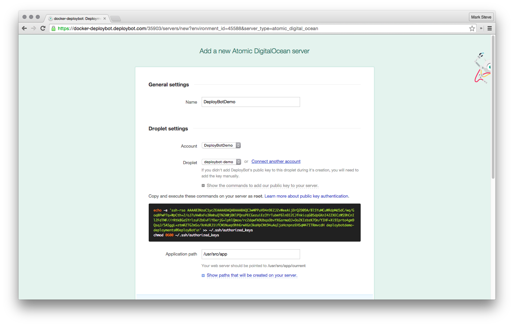

# Deploy Docker containers with DeployBot

## Requirements

- Docker Engine
- Docker Machine
- DigitalOcean Personal Access Token

## Steps

1. Create a machine

  I'll be naming my machine `deploybot-demo`

  ```bash
  docker-machine create \
      -d digitalocean \
      --digitalocean-access-token $DO_TOKEN \
      --digitalocean-image docker \
      --digitalocean-region sgp1 \
      --digitalocean-size 512mb \
      deploybot-demo
  ```

  Check if it works

  ```bash
  eval $(docker-machine env deploybot-demo)
  docker info
  ```

2. Sign up for DeployBot

3. Connect a repository

  

  _You can fork this repository to try it out_

4. Create an environment

5. Add a server

  Choose the Atomic DigitalOcean deployment option

  

  SSH to the machine

  ```bash
  docker-machine ssh deploybot-demo
  ```

  Copy commands to allow DeployBot to access the machine

  

  Install `docker-compose` (optional)

  ```bash
  curl -L https://github.com/docker/compose/releases/download/1.4.1/docker-compose-`uname -s`-`uname -m` > /usr/local/bin/docker-compose
  chmod +x /usr/local/bin/docker-compose
  ```

## Try it out


If you used this repository, you should be able to see a message
upon visiting `docker-machine ip deploybot-demo`

